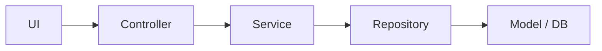

# URL Shortener with Spring Boot

A lightweight URL Shortener built using **Spring Boot**, **Maven**, and **H2 Database**.  
It takes any long URL, generates a **unique short link**, stores it in the database, tracks **click count**, and records **creation time**.

## Features

- Generate unique short URLs
- Stores links in H2 (in-memory database)
- Redirects users to original URLs
- Tracks:
  - When the link was created  
  - How many times it has been clicked
- MVC Architecture:  
  `MODEL → REPOSITORY → SERVICE → CONTROLLER → UI (Thymeleaf)`

## Architecture Overview


## Project Structure

```plaintext
src/
 └── main/
      ├── java/com/pranav/spring_boot_url_shortener/
      │      ├── controller/      # Handles HTTP requests
      │      ├── service/         # Business logic
      │      ├── model/           # JPA entity
      │      └── repository/      # Database access
      └── resources/
             ├── templates/       # Thymeleaf HTML files
             └── application.properties
```
## Tech Stack

| Technology       | Purpose                     |
|------------------|-----------------------------|
| Spring Boot      | Backend framework           |
| H2 Database      | In-memory DB for development |
| Spring Data JPA  | ORM & query generation      |
| Thymeleaf        | Template engine (UI)        |
| Maven            | Build tool                  |


## How to Run

### 1️. Clone the repository
```bash
git clone https://github.com/pran9v/url-shortener-springboot.git
cd url-shortener-springboot
```
### 2. Run the application
```
./mvnw spring-boot:run
```
### 3. Open in your browser
```
http://localhost:8080/
```

## API Endpoints

| Method | Endpoint       | Description                          |
|--------|----------------|--------------------------------------|
| GET    | `/`            | Home page with form                  |
| POST   | `/shorten`     | Creates a short URL                  |
| GET    | `/u/{code}`    | Redirects & increments click count   |


## H2 Database Access (Optional)

After running the application, visit:

```
http://localhost:8080/h2-console
```

Use the following JDBC URL:
```
jdbc:h2:mem:testdb
```
Make sure H2 is enabled in your application.properties:

```properties
spring.h2.console.enabled=true
spring.datasource.url=jdbc:h2:mem:testdb
spring.jpa.hibernate.ddl-auto=update
```

## Short URL Flow

```mermaid
sequenceDiagram
    autonumber
    participant U as User
    participant B as Browser
    participant C as UrlController
    participant S as UrlShortenerService
    participant R as UrlMappingRepository

    %% 1) User opens home page
    U->>B: Open /
    B->>C: GET /
    C-->>B: Return "index" view (empty form)
    B-->>U: Show URL form

    %% 2) User submits URL to shorten
    U->>B: Submit form with long URL
    B->>C: POST /shorten (url)
    C->>S: createShortUrl(url)

    S->>R: findByOriginalUrl(normalizedUrl)
    R-->>S: Existing mapping or empty


